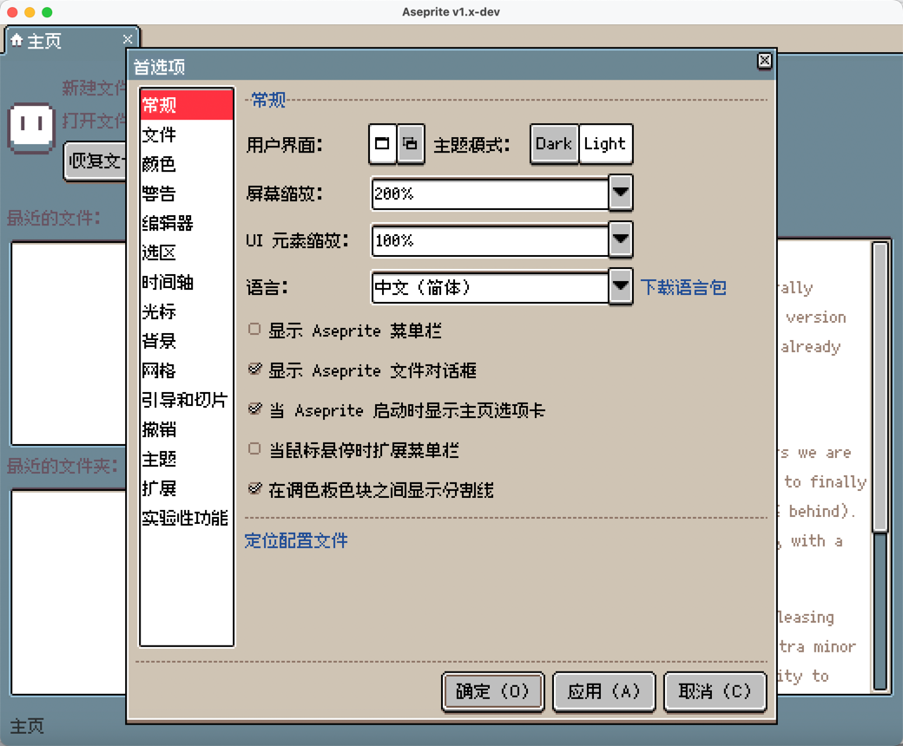

# 该扩展已经过时

Aseprite 翻译已经迁移至 [Weblate/Aseprite](https://hosted.weblate.org/projects/aseprite/)，语言扩展包的形式已经过时。

稍后时候，该仓库将进入归档模式。

如果您仍然想使用语言扩展包，请查看 [1.3.2](https://github.com/aseprite-quest/aseprite-language-chinese-simplified/releases/tag/1.3.2)，它适用于 [Aseprite-v1.3.2](https://github.com/aseprite/aseprite/releases/tag/v1.3.2) 以及之前的版本。

最新节点的[翻译文件](https://github.com/aseprite-quest/aseprite-language-chinese-simplified/blob/master/data/zh-hans.ini)已经针对 Weblate 进行过格式适配，可以直接导入。

任何人都可以随意使用该翻译文本。

# Aseprite 语言包 - 中文（简体）

推荐配合[「多语言像素主题」](https://github.com/aseprite-quest/aseprite-unified-pixel-theme)一起使用。

## 预览

## 辅助工具

- [Aseprite INI](https://github.com/aseprite-quest/aseprite-ini)

## 参考资料

- [中文文案排版指北](https://github.com/sparanoid/chinese-copywriting-guidelines)

## 许可证

翻译使用「知识共享署名 4.0 国际许可证」授权。

脚本使用[「MIT 许可证」](LICENSE)授权。
